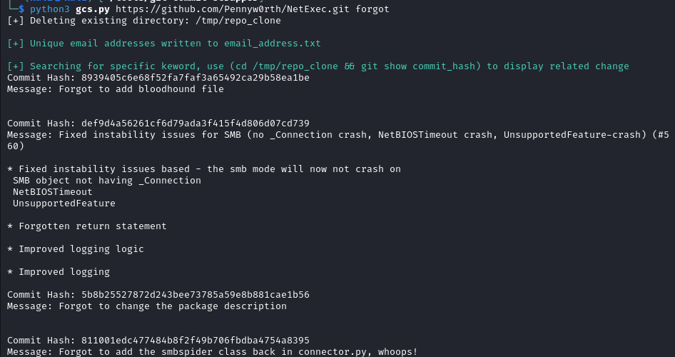
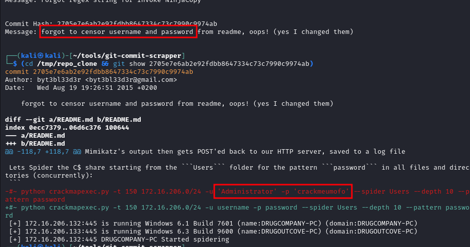

# git-commit-scraper

A small tool to scrape email and potential sensitive info in commit from a github repo.

To use for external pentest on coporate repo.

```
python script.py <repository_url> [keywords]
```


### Example on NetExec repo:



Found commit with old password


Got list of email from commit
